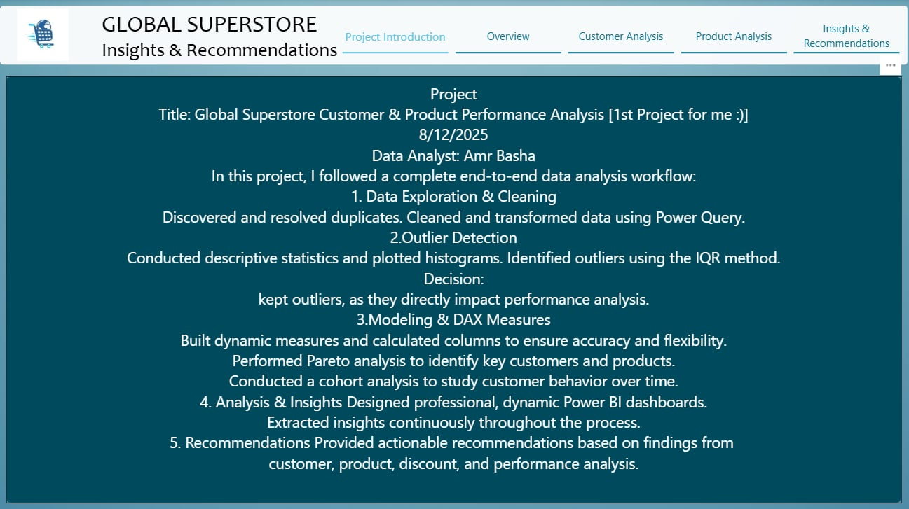
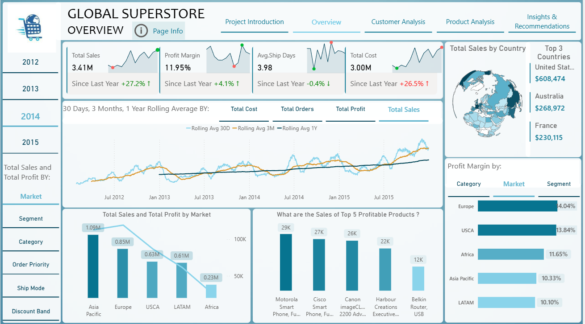
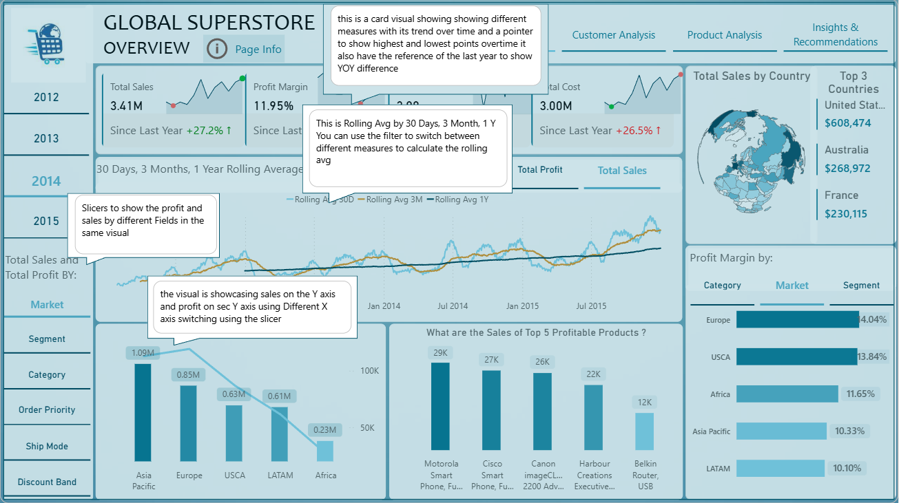

# Global Superstore BI Analysis


End-to-end Business Intelligence solution built in Power BI on the Global Superstore dataset. The project combines data modeling, advanced DAX, customer analytics (CLV/churn/cohorts), product portfolio optimization, and executive dashboard design to translate transactional data into strategic, decision-ready insights.

---

## Business Problem

Global Superstore operates across multiple geographies, customer segments, and product categories. Despite strong revenue pockets, leadership needs clear visibility into:

- where profit is created versus eroded,
- which customers are retained versus churned,
- which products deserve scale versus remediation,
- and how pricing/discounting behavior affects long-term performance.

Without a unified BI model, these questions remain fragmented across reports and difficult to operationalize.

---

## Business Objectives

- Quantify **Customer Lifetime Value (CLV)** and **lifetime churn risk**.
- Measure **cohort retention** behavior over multi-year periods.
- Identify **best and poorest products** using weighted performance ranking.
- Diagnose **profit erosion by discount bands** and region.
- Track **time-based performance** with YTD comparisons and rolling trends.
- Deliver an **executive dashboard experience** that supports fast strategic decisions.

---

## Business Impact

This solution gives executives and functional managers a shared analytical layer for growth and efficiency decisions. It supports:

- better allocation of sales/marketing resources by market and customer tier,
- discount governance to protect margin,
- retention program design based on measured churn dynamics,
- inventory and category strategy aligned to real profitability,
- and more credible performance tracking through standardized KPI logic.

---

## Project Architecture

```text
Raw Dataset
   ↓
Power Query
   ↓
Star Schema
   ↓
DAX Semantic Model
   ↓
Interactive Dashboard
   ↓
Business Insights
   ↓
Strategic Recommendations
```

For details: [Architecture Documentation](docs/Architecture.md)

---

## Data Model

The model follows a **Star Schema** design to optimize query performance and analytical clarity.

- **Fact Table**: `Fact_Sales` (sales transactions, quantity, profit, dates, customer/product references)
- **Dimension Tables**:
  - `Dim_Date`
  - `Dim_Customer`
  - `Dim_Product`
  - `Dim_Country`
  - Supporting dimensions for return status and segmentation

This structure enables robust filter propagation and reusable DAX measures across customer, product, time, and geography lenses.


For details: [Data Model Documentation](docs/Data_Model.md)

---

## Dashboard Preview

### 1) Introduction
- **Purpose:** Establish report scope, KPIs, and analytical context.
- **Business Value:** Align stakeholders before deep-dive analysis.
- **Screenshot:**
  

### 2) Executive Overview
- **Purpose:** Provide high-level trends for sales, profit, and key performance signals.
- **Business Value:** Enables quick executive scanning and prioritization.
- **Screenshot:**
  

### 3) Overview Page Notes
- **Purpose:** Explain metric definitions and interpretation guidance.
- **Business Value:** Reduces ambiguity and improves decision consistency.
- **Screenshot:**
  

### 4) Customer Analysis
- **Purpose:** Analyze CLV, churn, retention, cohorts, and segment behavior.
- **Business Value:** Supports retention strategy and customer portfolio decisions.
- **Screenshot:**
  

### 5) Product Analysis
- **Purpose:** Evaluate product performance with weighted ranking and return risk.
- **Business Value:** Informs assortment, pricing, and category optimization.
- **Screenshot:**
  

### 6) Insights & Recommendations
- **Purpose:** Synthesize findings into action-oriented strategic recommendations.
- **Business Value:** Connects analytics output directly to business action.
- **Screenshot:**
  

### 7) Customer/Product Details
- **Purpose:** Provide granular drill-through view for validation and investigation.
- **Business Value:** Enables analysts/managers to inspect root causes.
- **Screenshot:**
  

---

## Key Business Questions

1. What is the final **Customer Lifetime Value (CLV)**, and what percentage of the customer base constitutes **lifetime churn**?
2. How does retention evolve for established **customer cohorts** over multiple years, and where is the steepest drop-off?
3. Which products are the absolute **best and poorest performers** when weighted across **sales, profit, and returns**?
4. Which **discount bands** (for example, 40%+) drive the largest **profit erosion** versus sales gain by region?
5. What is the financial breakdown of sales/profit across tiered **customer classes** (Titanium, Platinum, Gold, Silver)?
6. How do return rates of high-profit products compare to average return behavior?
7. Which major product categories offer the highest and lowest **profit contribution**?
8. How does the **3-month rolling average** of profit compare against sales trend behavior?
9. Which customer segments (Consumer, Corporate, Home Office) produce the highest return rates?
10. Which countries are strongest and weakest in absolute sales and profit margin percentage?
11. What is the relationship between shipping duration and average order profitability?

---

## Key Findings (Executive Insights)

- **Revenue concentration is geographically uneven.** Asia Pacific leads total sales, while Africa materially lags, indicating opportunity-cost in current regional focus.
- **A distinct growth inflection occurred in August 2015.** The 3-month rolling trend indicates a short-window acceleration that should be traced and replicated.
- **Low discount bands are the primary volume engine.** Most sales are concentrated in modest discount levels, while deep-discount bands show weak efficiency.
- **Deep discounts are destroying margin in selected markets.** Australia, Turkey, and France demonstrate high sensitivity to discount-driven profit erosion.
- **Consumer segment has the highest return risk.** This elevates fulfillment and margin pressure and warrants targeted post-sale interventions.
- **Customer-tier economics are highly skewed.** Titanium customers are materially more valuable than Silver customers, supporting differentiated service strategy.
- **Churn is the largest structural risk.** A high lifetime churn rate suppresses realized value despite healthy estimated CLV potential.
- **Technology drives both revenue and profit share.** Furniture underperforms on contribution efficiency and requires portfolio-level remediation.

---

## Strategic Recommendations

| Problem | Recommendation | Expected Business Impact | Priority |
|---|---|---|---|
| Regional underperformance | Rebalance commercial focus from persistently low-performing markets toward proven demand clusters. | Higher revenue productivity per sales effort. | High |
| Unknown growth catalyst | Investigate pre-August 2015 activity (campaigns, pricing, channel moves) and codify repeatable levers. | Replicable growth playbook and faster scaling. | High |
| Margin erosion from deep discounts | Enforce discount governance, especially above 30%, with regional thresholds and approval controls. | Margin protection with controlled volume trade-offs. | High |
| Elevated consumer return rate | Launch segment-specific post-sale support and product-use enablement. | Reduced returns and improved realized profitability. | Medium |
| Weak lower-tier customer economics | Design lifecycle programs to move Silver customers upward or reduce acquisition spend inefficiency. | Improved customer portfolio ROI. | Medium |
| High lifetime churn | Implement 90-day second-purchase activation program and retention triggers. | Better repeat purchase rate and CLV realization. | High |
| Low furniture contribution | Conduct SKU-level profitability, discount sensitivity, and return diagnostics in Furniture. | Better assortment and pricing decisions. | Medium |
| Technology dependence risk | Scale Technology supply where justified while managing concentration risk via category diversification. | Growth continuity with reduced category concentration risk. | Medium |

---

## Technology Stack

| Category | Tools / Techniques | Role in Project |
|---|---|---|
| BI Platform | Power BI Desktop | Data model, semantic layer, reporting |
| Data Preparation | Power Query (M) | Cleansing, shaping, transformation |
| Analytical Language | DAX | KPIs, time intelligence, ranking, CLV/churn logic |
| Source Data | Excel | Input dataset |
| Modeling | Star Schema | Scalable analytics architecture |
| Domain | Business Analytics | Strategic KPI framing |
| Domain | Customer Analytics | CLV, churn, retention, cohorts |

---

## Repository Structure

```text
Global-Superstore-BI-Analysis/
├── README.md
├── docs/
│   ├── Architecture.md
│   ├── Data_Model.md
│   ├── Methodology.md
│   ├── Lessons_Learned.md
│   └── DAX/
│       ├── Pareto.md
│       ├── CustomerAnalytics.md
│       ├── ProductRanking.md
│       ├── TimeIntelligence.md
│       └── KPICards.md
├── Images/
│   ├── Architecture.png
│   ├── StarSchema.png
│   ├── Dashboard1.png
│   └── Dashboard2.png
├── Dataset/
│   └── Globa_Superstore.xlsx
├── PBIX/
│   └── Global_Superstore.pbix
├── SQL/
│   └── README.md
├── LICENSE
├── 1-Introduction.png
├── 2-Overview.png
├── 3-PageInfo.png
├── 4-Customers Analysis.png
├── 5-Products Analysis.png
├── 6-Insights and Recomendations.png
└── 7-Customer Details .png
```


---

## Advanced Documentation

- [Architecture](docs/Architecture.md)
- [Data Model](docs/Data_Model.md)
- [Methodology](docs/Methodology.md)
- [Advanced DAX Documentation - Pareto](docs/DAX/Pareto.md)
- [Advanced DAX Documentation - Customer Analytics](docs/DAX/CustomerAnalytics.md)
- [Advanced DAX Documentation - Product Ranking](docs/DAX/ProductRanking.md)
- [Advanced DAX Documentation - Time Intelligence](docs/DAX/TimeIntelligence.md)
- [Advanced DAX Documentation - KPI Cards](docs/DAX/KPICards.md)
- [Lessons Learned](docs/Lessons_Learned.md)

---

## Project Highlights

What makes this project stronger than a standard dashboard build:

- **Advanced Cohort Analysis:** Multi-period retention tracking, not just one-off segmentation.
- **Customer Lifetime Value (CLV):** CLV connected to churn dynamics for actionable customer strategy.
- **Weighted Product Ranking:** Composite score using sales, profit, and returns for portfolio decisions.
- **Dynamic Pareto Analysis:** Interactive thresholding and cumulative distribution logic.
- **Advanced Time Intelligence:** Rolling windows and robust period-over-period comparisons.
- **Business-Oriented Recommendations:** Findings translated into decision-ready actions with prioritization.

---

## Lessons Learned

- Strong BI outcomes depend on both **semantic model design** and **business framing**, not visuals alone.
- Churn and return behavior can materially alter the interpretation of top-line growth.
- Weighted metrics are often more reliable than single-metric ranking for product decisions.

For full details: [Lessons Learned](docs/Lessons_Learned.md)

---

## Future Improvements

- Implement Incremental Refresh for larger-scale refresh performance.
- Extend to Microsoft Fabric architecture.
- Build SQL warehouse-backed model variant.
- Add forecasting scenarios for sales/profit planning.
- Incorporate ML-driven churn propensity scoring.
- Add Python-based advanced statistical diagnostics.

---

## About the Author

| Field | Details |
|---|---|
| **Name** | Amr Basha |
| **Professional Title** | Microsoft Certified Power BI Data Analyst (PL-300) \| Business Intelligence Developer \| Data Analyst |
| **LinkedIn** | [LinkedIn Profile](https://www.linkedin.com/in/amr-basha-552912289/) |
| **Email** | amrbayoumybasha@gmail.com |

If you'd like, I can also provide a recruiter-optimized one-page project brief version for job applications.
